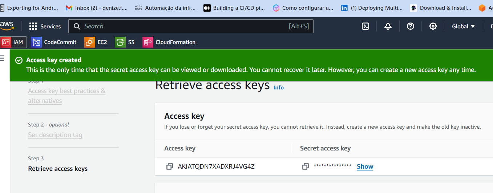
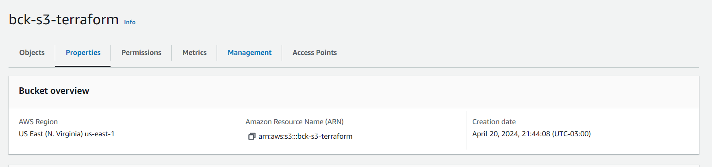
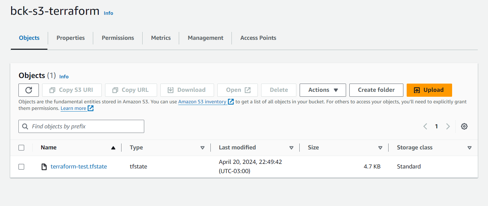

# Registo de reflexões e decisões


- [Registo de reflexões e decisões](#registo-de-reflexões-e-decisões)
  - [O problema](#o-problema)
    - [Automação da infra, provisionamento dos hosts (IaaS) e Automação de setup e configuração dos hosts (IaC)](#automação-da-infra-provisionamento-dos-hosts-iaas-e-automação-de-setup-e-configuração-dos-hosts-iac)
  - [Referências](#referências)
  - [Autora](#autora)
      
## O problema

Minha primeira decisão foi inciar a documentação como instruído. 

Então usei o seguinte comando para criar o dockerfile básico:
```
docker init 
```
Seguindo as informações fornecidas no readme coloquei as seguintes cofigurações:
>

>What application platform does your project use? Python
>What version of Python do you want to use? 3.7.4
>What port do you want your app to listen on? (8000) 8000
> What is the command you use to run your app? gunicorn --log-level debug api:app

Fiz um metódo para confirmar que consegui subir corretamente:
```py
@app.route('/')
def api_home():
    return "Hello World"
```
e então:
```
docker compose up --build
```


Agora procurar algum software opensource para fazer o primeiro requisito

### Automação da infra, provisionamento dos hosts (IaaS) e Automação de setup e configuração dos hosts (IaC)

Fiz uma pesquisa para encontrar qual tecnológia eu poderia usar para atender esses requisitos. Eu cheguei a tentar fazer um in-house provider, mas se mostrou mais complicado que eu imaginava, portanto seguirei com AWS que foi o que estudei durante o curso de DevOps da Ada.

Tive que me basear em alguns cursos para conseguir fazer a automação e provisionamento usando Terraform, coloquei nas referências [Terraform Essentials](#referências)

Esse curso sugere utilizar um container para usar o terraform então vou atualizar o projeto para fazer um dockercompose para esse terraform ter seu proprio container para provisionar a aws.
Incialmente vou rodar só o serviço para configurar o state para salvar em um bucket s3.

>Se eu tivesse mais tempo provavelmente faria uma condicional para criar o bucket caso não existisse como vi nesse [link](https://stackoverflow.com/questions/67482573/create-terraform-resource-s3-bucket-object-if-already-doesnt-exists) mas acho que não é o momento, então fui no console e criei uma accesskey em um user *(como não sei as pemissões que vou usar por enquanto vou deixar comoAdministratorAccess)* no IAM da AWS.  



Agora um bucket no S3 para guardar o state



Para o terraform eu vou criar um serviço no docker-compose  para rodar ele e manter o terminal interativo:
```
docker-compose run terraform
```

```tf
terraform:
    image: hashicorp/terraform:light
    stdin_open: true 
    tty: true 
    # stdin_open/tty = true para poder usar o terraform no container e não na minha maquina local
    working_dir: /app
    entrypoint: ''
    command: sh
    volumes:
      - C:/Users/deniz/OneDrive/Documents/desafio-devops/desafio-devops/app:/app    
      #para poder interagir com os arquivos do container mais facilmente e atulizar durante os testes
```
Dentro do container consigo realizar os comandos no terraform agora preciso cofigurar as chaves de acesso para isso criei um .env para serem usadas durante a execução do plano e então eu inicio o terraform com o seguinte comando:
```bash
terraform init -upgrade
```
e faço o plano:
```bash
terraform plan -out plano
```
Parece tudo certo, depois do apply o state chegou no meu bucket!




## Referências

[Containerize a Python application](https://docs.docker.com/language/python/containerize/)  
[Ideia de In-house provider](https://davidstamen.com/2021/04/13/using-an-in-house-provider-with-terraform-v0.14/)  
[Terraform Essentials](https://www.linuxtips.io/course/terraform-essentials)


## Autora

**Denize**

It is not luck, it is hard work!


Where to find me:


[](https://twitter.com/Dbassi91)   
[](https://www.linkedin.com/in/dbfigueiredo/)   
[](mailto:denize.f.bassi@gmail.com)   
[](https://codepen.io/debafig)   
[](https://www.facebook.com/d.bassi91/)   
[](https://github.com/DeBaFig)   
[](https://www.instagram.com/bassidenize/)   
[](https://debafig.github.io/me/)   
[](https://whatsa.me/5547935051914)
[](https://discordapp.com/users/DeBaFig#5875)
