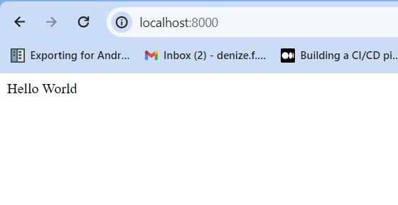

# Registo de reflexões e decisões


- [Registo de reflexões e decisões](#registo-de-reflexões-e-decisões)
  - [O problema](#o-problema)
  - [Referências](#referências)
  - [Autora](#autora)
      
## O problema

Minha primeira decisão foi inciar a documentação como instruído. 

Então usei o seguinte comando para criar o dockerfile básico:
```
docker init 
```
Seguindo as informações fornecidas no readme coloquei as seguintes cofigurações:
>

>What application platform does your project use? Python
> What version of Python do you want to use? 3.7.4
> What port do you want your app to listen on? (8000) 8000
>  What is the command you use to run your app? gunicorn --log-level debug api:app

Fiz um metódo para confirmar que consegui subir corretamente:
```py
@app.route('/')
def api_home():
    return "Hello World"
```
e então:
```
docker compose up --build
```



## Referências


## Autora

**Denize**

It is not luck, it is hard work!


Where to find me:


[](https://twitter.com/Dbassi91)   
[](https://www.linkedin.com/in/dbfigueiredo/)   
[](mailto:denize.f.bassi@gmail.com)   
[](https://codepen.io/debafig)   
[](https://www.facebook.com/d.bassi91/)   
[](https://github.com/DeBaFig)   
[](https://www.instagram.com/bassidenize/)   
[](https://debafig.github.io/me/)   
[](https://whatsa.me/5547935051914)
[](https://discordapp.com/users/DeBaFig#5875)
